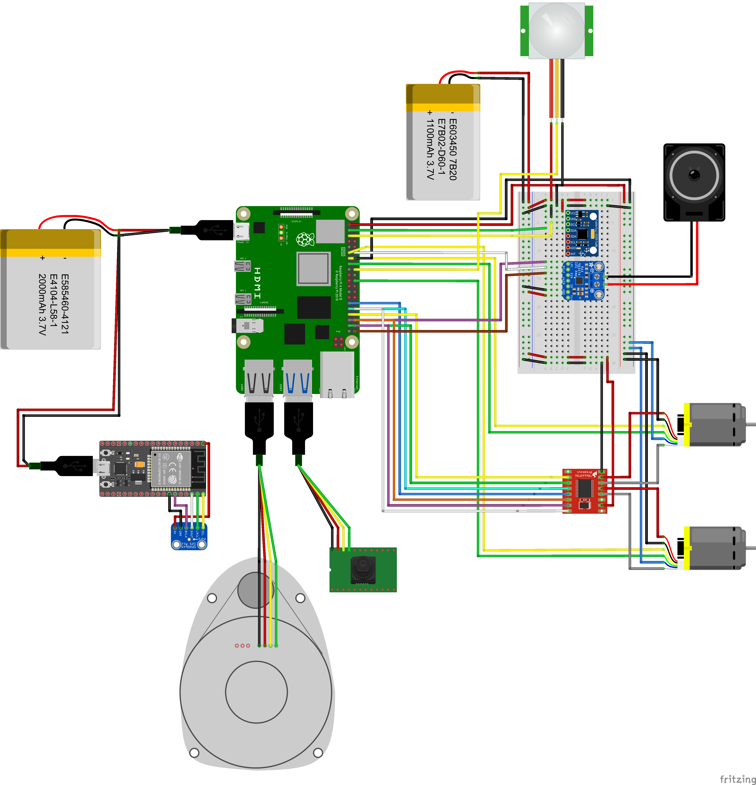
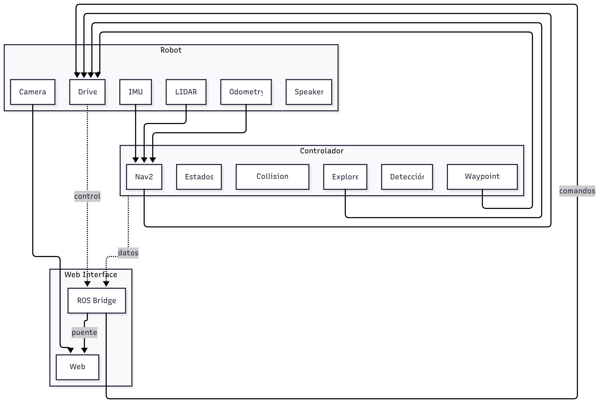
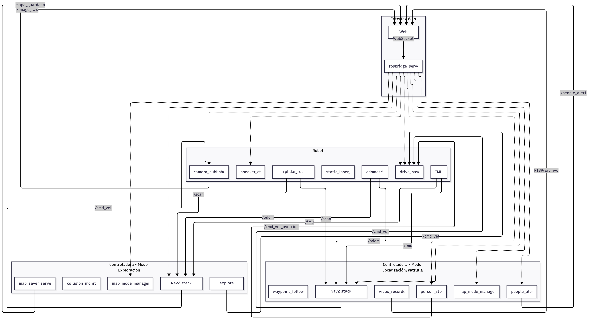
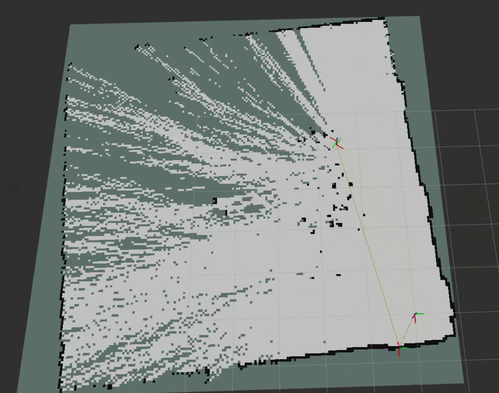
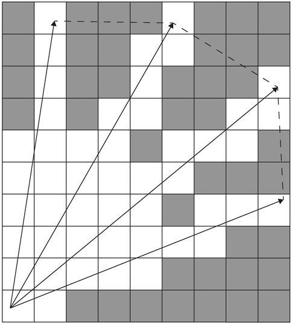

# Segurito 


## Tabla de Contenidos

1. [Introducción](#introducción)
2. [Componentes y Costos](#componentes-y-costos)
3. [Características](#características)
4. [Modelo 3D](#modelo-3d)
5. [Diagramas de Arquitectura](#diagramas-de-arquitectura)
   - [Diagrama de Hardware](#diagrama-de-hardware)
   - [Diagrama de Software](#diagrama-de-software)
6. [Instalación](#instalación)
   - [Requisitos](#requisitos)
   - [Guía de Instalación](#guía-de-instalación)
7. [Uso](#uso)
   - [Escaneo y Mapeo LiDAR](#escaneo-y-mapeo-lidar)
   - [Detección de Movimiento](#detección-de-movimiento)
   - [Reconocimiento de Objetos y Rostros](#reconocimiento-de-objetos-y-rostros)
   - [Monitoreo Remoto](#monitoreo-remoto)
8. [Algoritmos](#algoritmos)
9. [Contribuidores](#contribuidores)
10. [Licencia](#licencia)

---

## Introducción

Segurito es un robot de seguridad autónomo diseñado para patrullar y supervisar espacios como lo haría un vigilante dedicado. Equipado con sensores avanzados y conectividad en la nube, Segurito:

- Mapea su entorno usando algoritmos LiDAR y SLAM
- Detecta obstáculos y objetos en movimiento para una navegación segura
- Identifica humanos y animales mediante reconocimiento por cámara
- Activa alarmas y envía notificaciones remotas al detectar intrusos
- Envia y recibe audios de voz en remoto a traves del altavoz y del micrófono integrado

Segurito combina hardware con módulos de software inteligentes para dar una solución de seguridad integral.

---

## Características

- **Mapeo Autónomo**: Genera un mapa en tiempo real del entorno usando LiDAR y SLAM.
- **Evitación de Colisiones**: Detecta y evita obstáculos.
- **Detección de Movimiento**: Sensor PIR para mayor precisión.
- **Reconocimiento de Humanos y Animales**: Clasifica las figuras capturadas por la cámara.
- **Sistema de Alarma**: Emite sonidos a traves del altavoz al detectar intrusos y enviar notificaciones.
- **Comandos de Voz**: Micrófono para hablar.
- **Conectividad en la Nube**: Envía alertas y transmisión de video en vivo a un panel remoto.

---

## Componentes y Costos

| Componente                  | Cantidad | Costo Aprox. (USD) | Enlace al Proveedor     |
|-----------------------------|:--------:|-------------------:|-------------------------|
| Micro Metal Motors          |    2     |             35.00  | [Enlace](https://tienda.bricogeek.com/motores/113-motor-micro-metal-lp-con-reductora-10-1.html)                   |
| Raspberry Pi 4B (4 GB RAM)  |    1     |             67.90  | [Enlace](https://tienda.bricogeek.com/placas-raspberry-pi/1330-raspberry-pi-4-model-b-4-gb.html)                  |
| Sensor de Movimiento PIR    |    1     |             1.85   | [Enlace](https://tienda.bricogeek.com/sensores-distancia/1270-modulo-sensor-pir-hc-sr501.html)                    |
| RPLIDAR-C1                  |    1     |             79.95  | [Enlace](https://tienda.bricogeek.com/sensores-distancia/1943-rplidar-c1-360-grados-12-metros-ip54.html)          |
| Acelerometro y Giroscopio   |    1     |             2.95   | [Enlace](https://tienda.bricogeek.com/acelerometros/1682-modulo-gy-521-acelerometro-y-giroscopio-mpu-6050.html)   |
| Ruedas Solarbotic           |    2     |             9.80   | [Enlace](https://tienda.bricogeek.com/ruedas-robotica/1008-rueda-solarbotics-rw2i.html)                           |
| Rueda Loca                  |    1     |             5.50   | [Enlace](https://tienda.bricogeek.com/robotica/995-rueda-loca-plastico-abs-34.html)                               |
| Altavoz                     |    1     |             5.50   | [Enlace](https://tienda.bricogeek.com/varios/938-altavoz-con-caja-3w.html)                                        |
| Controladores de Motor      |    1     |             5.95   | [Enlace](https://tienda.bricogeek.com/controladores-motores/999-controlador-de-motores-tb6612fng.html)            |
| Microfono                   |    1     |             7.30   | [Enlace](https://tienda.bricogeek.com/sensores-sonido/1475-microfono-digital-mems-i2s-sph0645.html)               |
| Controladora de Microfono   |    1     |             6.50   | [Enlace](https://tienda.bricogeek.com/arduino-compatibles/1274-nodemcu-esp32-wroom-wifi-bluetooth.html)           |
| Camara                      |    1     |             19.95  | [Enlace](https://tienda.bricogeek.com/accesorios-raspberry-pi/822-camara-raspberry-pi-v2-8-megapixels.html)       |
| Encoders de Motor           |    2     |             8.50   | [Enlace](https://tienda.bricogeek.com/accesorios-motores/932-encoders-para-motores-micro-metal-12cpr.html)        |
| Powerbank y Bateria         |    2     |             10.00  | —                                                                                                                 |
| Breadboard y Cables         |    1     |             0.00   | —                                                                                                                 |
| Chasis Impreso en 3D        |    1     |             4.00   | —                                                                                                                 |
| **Total**                   |          |          **270.60**|                                                                                                                   |

---

## Modelo 3D

El chasis completo del robot y los soportes de los componentes han sido diseñados en OnShape. Puedes encontrar los archivos del modelo aquí:

- `3Dmodels/Base.stl`
- `3Dmodels/Adaptador Base.stl`
- `3Dmodels/Segundo Piso.stl`
- `3Dmodels/Adaptador Sensor PIR.stl`
- `3Dmodels/Adaptador Lidar.stl`
- `3Dmodels/Cupula.stl`

Vista Previa del Ensamblaje 3D


---

## Diagramas de Arquitectura

### Diagrama de Hardware

El circuito ha sido creado mediante la herramienta Fritzing, puedes encontrar el archivo aquí:

- `circuits/EsquemaCircuitos.fzz`



### Diagrama de Software

Diagrama simplificado.



Diagrama completo.



---

## Instalación

### Requisitos

| Paquete / Stack                                        | Versión recomendada        |
|--------------------------------------------------------|----------------------------|
| Python                                                 | 3.10 +                     |
| OpenCV                                                 | 4.x                        |
| **ROS 2 Humble**                                       | Desktop-Full               |
| NumPy, SciPy, scikit-learn                             | —                          |
| SLAM (p. ej. `rtabmap_ros`)                            | versión Humble             |
| TensorFlow / PyTorch                                   | —                          |
| **Navigation2 (stack Nav2)**<br/>`nav2_bringup`, `nav2_waypoint_follower`, `nav2_collision_monitor`, `nav2_wfd` | versión Humble |
| `rosbridge_suite` (`rosbridge_server`)                 | versión Humble             |
| `vision_opencv` (`cv_bridge`, `image_transport`)       | versión Humble             |
| `rplidar_ros`                                          | versión Humble             |
| GStreamer 1.0 (para RTSP/streaming)                    | ≥ 1.18                     |
| Node.js + npm (para la web React)                      | ≥ 18 LTS                   |


> **Nota:** ROS 2 Humble está pensado para Ubuntu 22.04 LTS.
### Guía de Instalación

> Estas instrucciones están pensadas para una **Raspberry Pi 4 B** (4 GB RAM) corriendo **Ubuntu 22.04 LTS (64 bit)**, que es la distribución soportada oficialmente por **ROS 2 Humble** y los paquetes listados en la tabla de requisitos.  
> Ajusta los comandos a tu arquitectura (x86_64 / ARM64) si vas a montar Segurito sobre otro hardware.

---

### 1. Preparar el sistema operativo

1. **Flashear Ubuntu Server 22.04 LTS**  
   Descarga la imagen para Raspberry Pi desde la web de Canonical y grábala en la micro-SD:
   ```bash
   sudo dd if=ubuntu-22.04-preinstalled-server-arm64+raspi.img \
           of=/dev/sdX bs=4M status=progress conv=fsync
   ```
2. **Primer arranque y configuración básica**  
   - Cambia la contraseña por defecto (`ubuntu/ubuntu`).  
   - Actualiza el sistema:
     ```bash
     sudo apt update && sudo apt full-upgrade -y
     sudo reboot
     ```
   - Activa la cámara y el I²C en `/boot/firmware/config.txt` (si es necesario).

---

### 2. Instalar ROS 2 Humble

> Sigue la guía oficial <https://docs.ros.org/en/humble/Installation/Ubuntu-Install-Debians.html>.

```bash
# Añadir repositorio y claves
sudo apt install curl gnupg lsb-release -y
sudo curl -sSL https://raw.githubusercontent.com/ros/rosdistro/master/ros.asc \
     | sudo tee /usr/share/keyrings/ros-archive-keyring.gpg >/dev/null
echo "deb [arch=$(dpkg --print-architecture) signed-by=/usr/share/keyrings/ros-archive-keyring.gpg] \
     http://packages.ros.org/ros2/ubuntu $(lsb_release -cs) main" \
     | sudo tee /etc/apt/sources.list.d/ros2.list

# Instalar metapaquete Desktop-Full (incluye Nav2 y rqt)
sudo apt update
sudo apt install ros-humble-desktop-full -y

# Configurar el entorno
echo "source /opt/ros/humble/setup.bash" >> ~/.bashrc
source ~/.bashrc
```

---

### 3. Instalar dependencias específicas

```bash
# LiDAR RPLIDAR-C1
sudo apt install ros-humble-rplidar-ros -y

# SLAM y exploración
sudo apt install ros-humble-rtabmap-ros ros-humble-nav2-bringup \
                 ros-humble-nav2-waypoint-follower \
                 ros-humble-nav2-collision-monitor \
                 ros-humble-nav2-wfd -y

# Puente WebSocket
sudo apt install ros-humble-rosbridge-suite -y

# Visión por computador
sudo apt install ros-humble-vision-opencv ros-humble-cv-bridge \
                 ros-humble-image-transport -y

# Python scientific stack
sudo apt install python3-pip python3-venv -y
python3 -m venv ~/segurito_venv
source ~/segurito_venv/bin/activate
pip install --upgrade pip
pip install opencv-python==4.* numpy scipy scikit-learn \
            torch torchvision tensorflow  # opcional según modelo

# GStreamer 1.18 + para streaming RTSP
sudo apt install gstreamer1.0-tools gstreamer1.0-plugins-base \
                 gstreamer1.0-plugins-good gstreamer1.0-plugins-bad -y

# Node.js 18 LTS para el panel web
curl -fsSL https://deb.nodesource.com/setup_18.x | sudo -E bash -
sudo apt install -y nodejs
```

---

### 4. Clonar y compilar el workspace

```bash
mkdir -p ~/segurito_ws/src
cd ~/segurito_ws/src
git clone https://github.com/yourusername/segurito.git
cd ~/segurito_ws

# Instalar dependencias ROS declaradas en package.xml
rosdep update
rosdep install --from-paths src --ignore-src -r -y

# Compilar con colcon
colcon build --symlink-install
source install/setup.bash
echo "source ~/segurito_ws/install/setup.bash" >> ~/.bashrc
```

---

### 5. Lanzar Segurito

```bash
# Lanza todo el stack (navegación, LiDAR, visión y web)
# Controlador
ros2 launch segurito_exploration_node web_backend.launch.py
npm dev run #Web
# Robot
ros2 launch segurito_production mapping_launch.py
```

---

### 6. Verificación rápida

| Función                    | Comando de prueba                                                 | Resultado esperado                              |
|----------------------------|-------------------------------------------------------------------|------------------------------------------------|
| LiDAR /scan                | `ros2 topic echo /scan --once`                                    | Muestra 360 rays JSON                          |
| Stream cámara              | `rqt_image_view /camera/image_raw`                                | Imagen en vivo                                 |
| SLAM RTAB-Map              | `ros2 launch rtabmap_ros rtabmap.launch.py rviz:=true`            | Mapa en RViz                                   |
| Nav2 Waypoint Follower     | `ros2 action send_goal /follow_waypoints nav2_msgs/FollowWaypoints`| Robot navega por los waypoints                 |


---

## Uso

   Una vez completada la [instalación](#instalación) y con **Segurito** encendido

### 1. Panel Web (GUI)

El panel se ejecuta automáticamente cuando lanzas el stack y está disponible en:

```
http://<IP_DEL_CONTROLADOR>:8080
```

| Función | Dónde encontrarla | Qué hace |
|---------|------------------|----------|
| **Live View** | Pestaña *Dashboard* | Muestra vídeo en tiempo real con superposición de detección de personas/animales (YOLO v11). |
| **Comenzar exploración** | Botón en *Navigation* | Inicia mapeo autónomo y exploración de fronteras usando LiDAR + SLAM *(WFD + RTAB‑Map)*. |
| **Cargar mapa** | *Maps › Upload* | Sube un `.pgm/.yaml` previamente guardado para patrullar sobre un entorno conocido. |
| **Control remoto** | Joystick virtual / teclado WASD | Teleoperación directa para movimientos puntuales. |
| **Alerts**


### Flujo típico de trabajo

1. **Lanzar stack**  
   ```bash
   ros2 launch segurito bringup.launch.py
   ```
2. Abrir navegador en `http://<IP_DEL_ROBOT>:8080`.
3. Pulsar **Empezar exploración** → el robot mapea.
4. Opcional: **Guardar mapa** al terminar.
5. En **Cargar mapa**, cargar el mapa y definir ruta de patrulla.
6. Activar **Alerts** para recibir notificaciones fuera de horario.

Con esto, Segurito patrullará su entorno, evitará colisiones, detectará intrusos y te avisará en tiempo real.

---

> ¿Problemas? Consulta los logs con `ros2 run rclcpp_components component_container` o abre un *ticket* en el repositorio.

---

## Algoritmos

- **SLAM**: Fusión con RTAB‑Map de nubes de puntos LiDAR y odometría.

   

   [Image Source](resources/GenerationMap.png)

- **Wavefront Frontier Exploration**: Método para identificar "fronteras" entre areas en un mapa de ocupación y decidir el siguiente camino.

   

   [Image Source](https://www.frontiersin.org/journals/robotics-and-ai/articles/10.3389/frobt.2021.616470/full)

- **Planificación de Rutas**: Usamos A* / Dijkstra para la busqueda de la ruta optima mediante costes acumulados desde el inivio g().

   

   [Image Source](https://github.com/AtsushiSakai/PythonRobotics)

- **Yolo V11**: Detector de figuras humanas de una sola etapa en tiempo real que divide la imagen en celdas para predecir simultáneamente cajas delimitadoras y probabilidades.

   

   [Image Source](https://learnopencv.com/yolo11/)

---

## Contribuidores

- 1 (@iliaschh) - Ilias Chakrane Hedioued   
- 2 (@isma-fernandez) — Ismael Fernandez Zarza  
- 3 (@towni848) — Antonio Morcillo Luque
---

## Licencia
